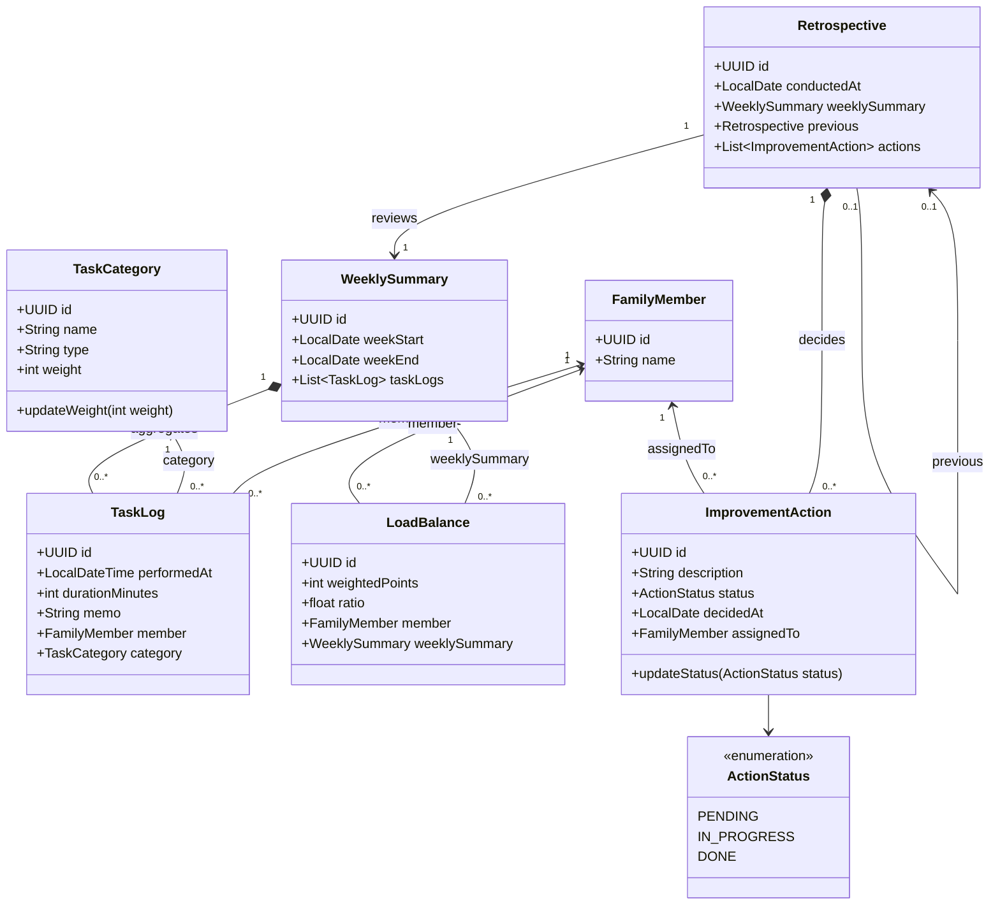
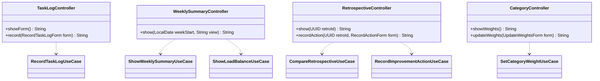
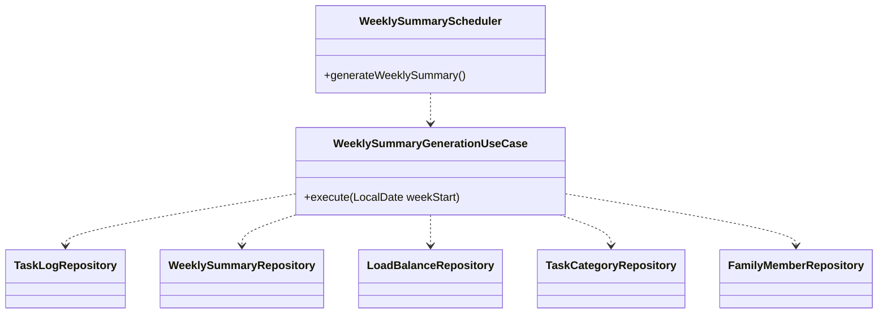

# クラス図

## ドメイン層

```mermaid
classDiagram
    class FamilyMember {
        +UUID id
        +String name
    }

    class TaskCategory {
        +UUID id
        +String name
        +String type
        +int weight
        +updateWeight(int weight)
    }

    class TaskLog {
        +UUID id
        +LocalDateTime performedAt
        +int durationMinutes
        +String memo
        +FamilyMember member
        +TaskCategory category
    }

    class WeeklySummary {
        +UUID id
        +LocalDate weekStart
        +LocalDate weekEnd
        +List~TaskLog~ taskLogs
    }

    class LoadBalance {
        +UUID id
        +int weightedPoints
        +float ratio
        +FamilyMember member
        +WeeklySummary weeklySummary
    }

    class Retrospective {
        +UUID id
        +LocalDate conductedAt
        +WeeklySummary weeklySummary
        +Retrospective previous
        +List~ImprovementAction~ actions
    }

    class ImprovementAction {
        +UUID id
        +String description
        +ActionStatus status
        +LocalDate decidedAt
        +FamilyMember assignedTo
        +updateStatus(ActionStatus status)
    }

    class ActionStatus {
        <<enumeration>>
        PENDING
        IN_PROGRESS
        DONE
    }

    FamilyMember "1" <-- "0..*" TaskLog : member
    TaskCategory "1" <-- "0..*" TaskLog : category
    WeeklySummary "1" *-- "0..*" TaskLog : aggregates
    WeeklySummary "1" <-- "0..*" LoadBalance : weeklySummary
    FamilyMember "1" <-- "0..*" LoadBalance : member
    Retrospective "1" --> "1" WeeklySummary : reviews
    Retrospective "0..1" <-- "0..1" Retrospective : previous
    Retrospective "1" *-- "0..*" ImprovementAction : decides
    FamilyMember "1" <-- "0..*" ImprovementAction : assignedTo
    ImprovementAction --> ActionStatus
```

---

## リポジトリインターフェース（ドメイン層）

```mermaid
classDiagram
    class FamilyMemberRepository {
        <<interface>>
        +findById(UUID id) FamilyMember
        +findAll() List~FamilyMember~
    }

    class TaskCategoryRepository {
        <<interface>>
        +findById(UUID id) TaskCategory
        +findAll() List~TaskCategory~
        +save(TaskCategory category)
    }

    class TaskLogRepository {
        <<interface>>
        +save(TaskLog taskLog)
        +findByWeeklySummary(WeeklySummary summary) List~TaskLog~
    }

    class WeeklySummaryRepository {
        <<interface>>
        +findByWeekStart(LocalDate weekStart) Optional~WeeklySummary~
        +save(WeeklySummary summary)
    }

    class LoadBalanceRepository {
        <<interface>>
        +findByWeeklySummary(WeeklySummary summary) List~LoadBalance~
        +save(LoadBalance balance)
    }

    class RetrospectiveRepository {
        <<interface>>
        +findById(UUID id) Retrospective
        +findPrevious(Retrospective retro) Optional~Retrospective~
        +save(Retrospective retro)
    }

    class ImprovementActionRepository {
        <<interface>>
        +findByRetrospective(Retrospective retro) List~ImprovementAction~
        +save(ImprovementAction action)
    }
```

---

## アプリケーション層（ユースケース）

```mermaid
classDiagram
    class RecordTaskLogUseCase {
        +execute(RecordTaskLogCommand command)
    }

    class ShowWeeklySummaryUseCase {
        +execute(LocalDate weekStart) WeeklySummaryView
    }

    class ShowLoadBalanceUseCase {
        +execute(LocalDate weekStart) LoadBalanceView
    }

    class RecordImprovementActionUseCase {
        +execute(UUID retroId, String description, UUID memberId)
    }

    class CompareRetrospectiveUseCase {
        +execute(UUID retroId) CompareRetrospectiveView
    }

    class SetCategoryWeightUseCase {
        +execute(Map~UUID, Integer~ weightMap)
    }

    RecordTaskLogUseCase ..> TaskLogRepository
    RecordTaskLogUseCase ..> TaskCategoryRepository
    RecordTaskLogUseCase ..> FamilyMemberRepository
    ShowWeeklySummaryUseCase ..> WeeklySummaryRepository
    ShowWeeklySummaryUseCase ..> TaskLogRepository
    ShowLoadBalanceUseCase ..> WeeklySummaryRepository
    ShowLoadBalanceUseCase ..> LoadBalanceRepository
    RecordImprovementActionUseCase ..> RetrospectiveRepository
    RecordImprovementActionUseCase ..> FamilyMemberRepository
    RecordImprovementActionUseCase ..> ImprovementActionRepository
    CompareRetrospectiveUseCase ..> RetrospectiveRepository
    CompareRetrospectiveUseCase ..> LoadBalanceRepository
    CompareRetrospectiveUseCase ..> ImprovementActionRepository
    SetCategoryWeightUseCase ..> TaskCategoryRepository
```

---

## プレゼンテーション層

```mermaid
classDiagram
    class TaskLogController {
        +showForm() String
        +record(RecordTaskLogForm form) String
    }

    class WeeklySummaryController {
        +show(LocalDate weekStart, String view) String
    }

    class RetrospectiveController {
        +show(UUID retroId) String
        +recordAction(UUID retroId, RecordActionForm form) String
    }

    class CategoryController {
        +showWeights() String
        +updateWeights(UpdateWeightsForm form) String
    }

    TaskLogController ..> RecordTaskLogUseCase
    WeeklySummaryController ..> ShowWeeklySummaryUseCase
    WeeklySummaryController ..> ShowLoadBalanceUseCase
    RetrospectiveController ..> CompareRetrospectiveUseCase
    RetrospectiveController ..> RecordImprovementActionUseCase
    CategoryController ..> SetCategoryWeightUseCase
```

---

## インフラ層（スケジューラ）

```mermaid
classDiagram
    class WeeklySummaryScheduler {
        +generateWeeklySummary()
    }

    class WeeklySummaryGenerationUseCase {
        +execute(LocalDate weekStart)
    }

    WeeklySummaryScheduler ..> WeeklySummaryGenerationUseCase
    WeeklySummaryGenerationUseCase ..> TaskLogRepository
    WeeklySummaryGenerationUseCase ..> WeeklySummaryRepository
    WeeklySummaryGenerationUseCase ..> LoadBalanceRepository
    WeeklySummaryGenerationUseCase ..> TaskCategoryRepository
    WeeklySummaryGenerationUseCase ..> FamilyMemberRepository
```
