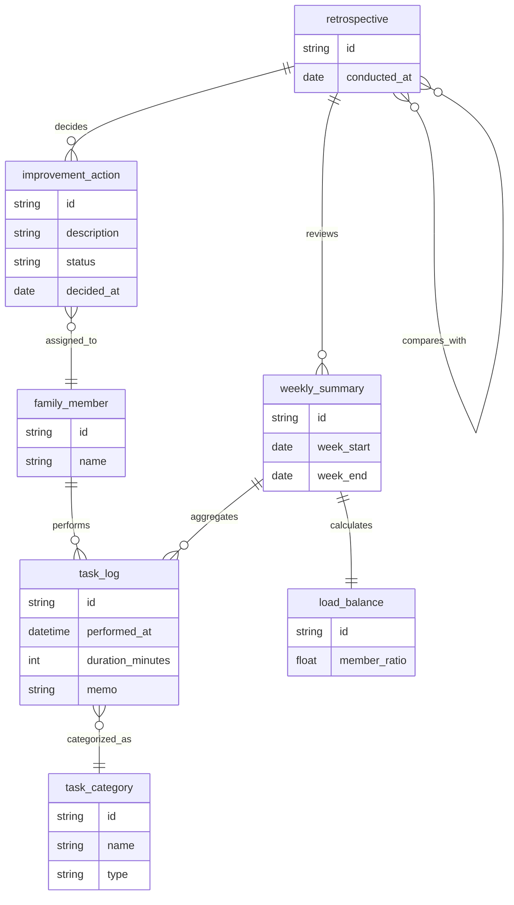

```mermaid
erDiagram
    family_member {
        string id
        string name
    }
    task_category {
        string id
        string name
        string type
    }
    task_log {
        string id
        datetime performed_at
        int duration_minutes
        string memo
    }
    weekly_summary {
        string id
        date week_start
        date week_end
    }
    load_balance {
        string id
        float member_ratio
    }
    improvement_action {
        string id
        string description
        string status
        date decided_at
    }
    retrospective {
        string id
        date conducted_at
    }

    family_member ||--o{ task_log : "performs"
    task_log }o--|| task_category : "categorized_as"
    weekly_summary ||--o{ task_log : "aggregates"
    weekly_summary ||--|| load_balance : "calculates"
    retrospective ||--o{ weekly_summary : "reviews"
    retrospective ||--o{ improvement_action : "decides"
    retrospective }o--o{ retrospective : "compares_with"
    improvement_action }o--|| family_member : "assigned_to"
```
