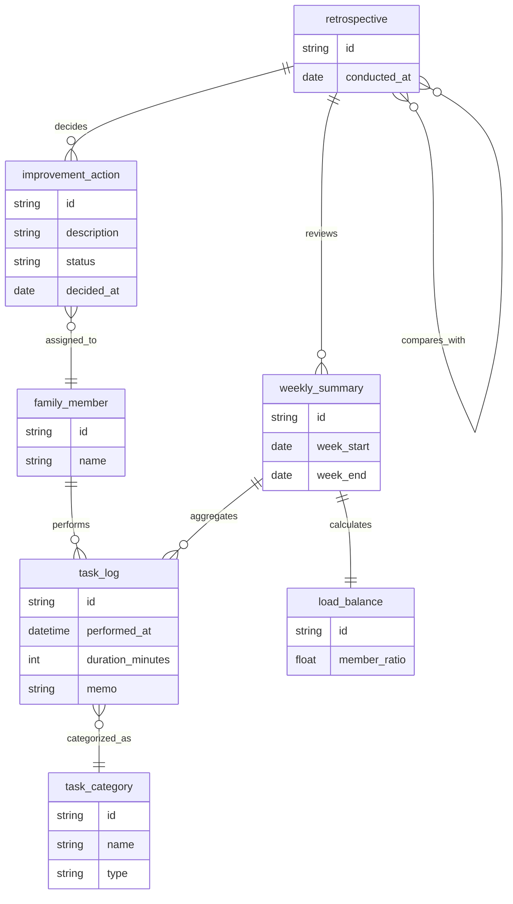
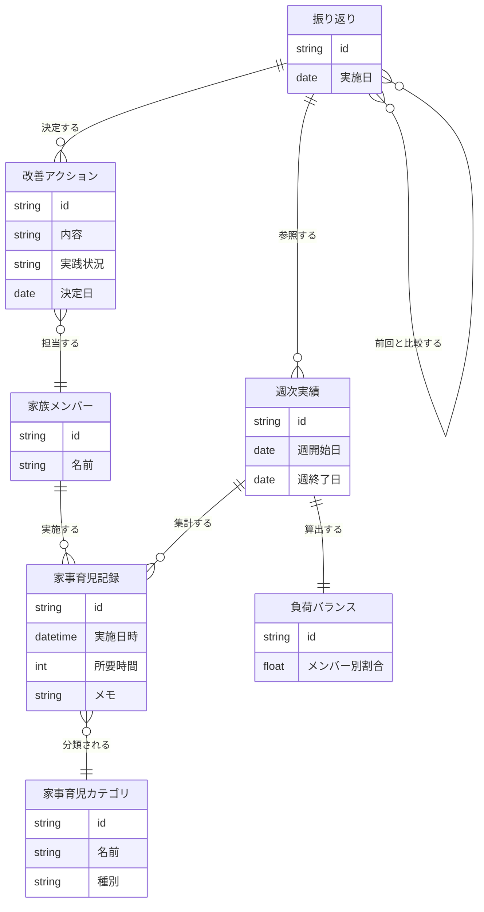

```mermaid
erDiagram
    family_member {
        string id
        string name
    }
    task_category {
        string id
        string name
        string type
    }
    task_log {
        string id
        datetime performed_at
        int duration_minutes
        string memo
    }
    weekly_summary {
        string id
        date week_start
        date week_end
    }
    load_balance {
        string id
        float member_ratio
    }
    improvement_action {
        string id
        string description
        string status
        date decided_at
    }
    retrospective {
        string id
        date conducted_at
    }

    family_member ||--o{ task_log : "performs"
    task_log }o--|| task_category : "categorized_as"
    weekly_summary ||--o{ task_log : "aggregates"
    weekly_summary ||--|| load_balance : "calculates"
    retrospective ||--o{ weekly_summary : "reviews"
    retrospective ||--o{ improvement_action : "decides"
    retrospective }o--o{ retrospective : "compares_with"
    improvement_action }o--|| family_member : "assigned_to"
```

---

```mermaid
erDiagram
    家族メンバー {
        string id
        string 名前
    }
    家事育児カテゴリ {
        string id
        string 名前
        string 種別
    }
    家事育児記録 {
        string id
        datetime 実施日時
        int 所要時間
        string メモ
    }
    週次実績 {
        string id
        date 週開始日
        date 週終了日
    }
    負荷バランス {
        string id
        float メンバー別割合
    }
    改善アクション {
        string id
        string 内容
        string 実践状況
        date 決定日
    }
    振り返り {
        string id
        date 実施日
    }

    家族メンバー ||--o{ 家事育児記録 : "実施する"
    家事育児記録 }o--|| 家事育児カテゴリ : "分類される"
    週次実績 ||--o{ 家事育児記録 : "集計する"
    週次実績 ||--|| 負荷バランス : "算出する"
    振り返り ||--o{ 週次実績 : "参照する"
    振り返り ||--o{ 改善アクション : "決定する"
    振り返り }o--o{ 振り返り : "前回と比較する"
    改善アクション }o--|| 家族メンバー : "担当する"
```
