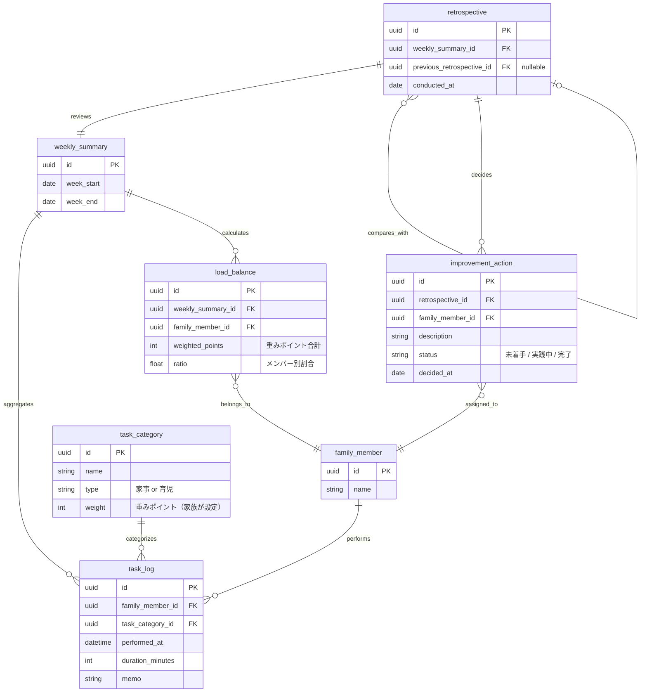

# ER図

> カテゴリ（task_category）は初期データとして固定投入。重み（weight）は家族がアプリ内で設定可能。

```mermaid
erDiagram
    family_member {
        uuid id PK
        string name
    }

    task_category {
        uuid id PK
        string name
        string type "家事 or 育児"
        int weight "重みポイント（家族が設定）"
    }

    task_log {
        uuid id PK
        uuid family_member_id FK
        uuid task_category_id FK
        datetime performed_at
        int duration_minutes
        string memo
    }

    weekly_summary {
        uuid id PK
        date week_start
        date week_end
    }

    load_balance {
        uuid id PK
        uuid weekly_summary_id FK
        uuid family_member_id FK
        int weighted_points "重みポイント合計"
        float ratio "メンバー別割合"
    }

    retrospective {
        uuid id PK
        uuid weekly_summary_id FK
        uuid previous_retrospective_id FK "nullable"
        date conducted_at
    }

    improvement_action {
        uuid id PK
        uuid retrospective_id FK
        uuid family_member_id FK
        string description
        string status "未着手 / 実践中 / 完了"
        date decided_at
    }

    family_member ||--o{ task_log : "performs"
    task_category ||--o{ task_log : "categorizes"
    weekly_summary ||--o{ task_log : "aggregates"
    weekly_summary ||--o{ load_balance : "calculates"
    load_balance }o--|| family_member : "belongs_to"
    retrospective ||--|| weekly_summary : "reviews"
    retrospective }o--o| retrospective : "compares_with"
    retrospective ||--o{ improvement_action : "decides"
    improvement_action }o--|| family_member : "assigned_to"
```
