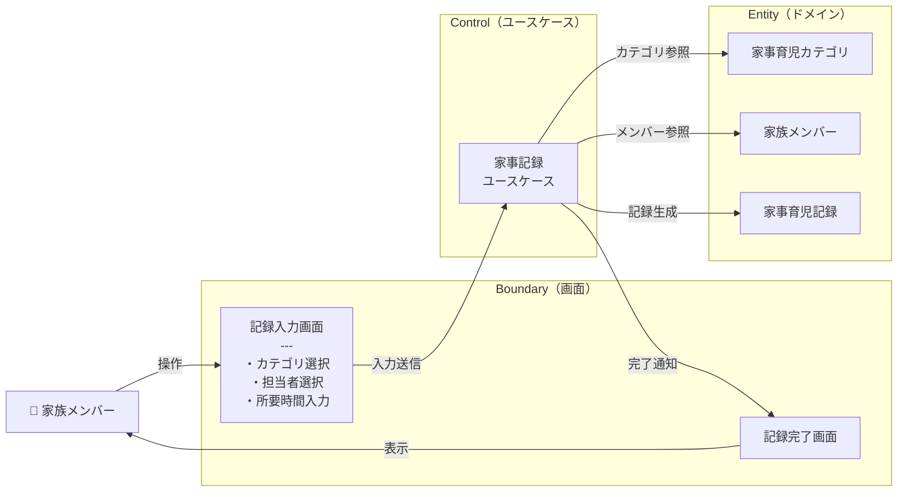

# ロバストネス図 - UC1: 家事・育児を記録する

## 前提
- 実施日時は記録操作時点で自動設定（ユーザー入力不要）
- 家族メンバー・カテゴリは固定マスタ（選択式）

```mermaid
flowchart LR
    actor["👤 家族メンバー"]

    subgraph Boundary["Boundary（画面）"]
        screen["記録入力画面\n---\n・カテゴリ選択\n・担当者選択\n・所要時間入力"]
        confirm["記録完了画面"]
    end

    subgraph Control["Control（ユースケース）"]
        uc["家事記録\nユースケース"]
    end

    subgraph Entity["Entity（ドメイン）"]
        taskLog["家事育児記録"]
        category["家事育児カテゴリ"]
        member["家族メンバー"]
    end

    actor -->|操作| screen
    screen -->|入力送信| uc
    uc -->|カテゴリ参照| category
    uc -->|メンバー参照| member
    uc -->|記録生成| taskLog
    uc -->|完了通知| confirm
    confirm -->|表示| actor
```
