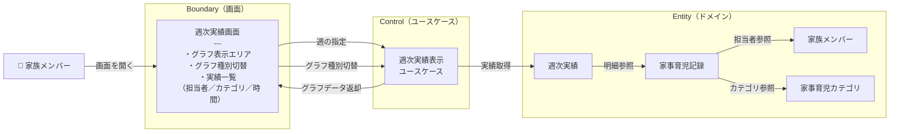

# ロバストネス図 - UC2: 週次実績を確認する

## 前提
- デフォルト表示は円グラフ
- グラフ種別はユーザーが切り替え可能（円グラフ・棒グラフ等、種類は後続で確定）
- 一覧では「誰が・何の家事を・何時間」を表示

```mermaid
flowchart LR
    actor["👤 家族メンバー"]

    subgraph Boundary["Boundary（画面）"]
        screen["週次実績画面\n---\n・グラフ表示エリア\n・グラフ種別切替\n・実績一覧\n　（担当者／カテゴリ／時間）"]
    end

    subgraph Control["Control（ユースケース）"]
        uc["週次実績表示\nユースケース"]
    end

    subgraph Entity["Entity（ドメイン）"]
        summary["週次実績"]
        taskLog["家事育児記録"]
        member["家族メンバー"]
        category["家事育児カテゴリ"]
    end

    actor -->|画面を開く| screen
    screen -->|週の指定| uc
    uc -->|実績取得| summary
    summary -->|明細参照| taskLog
    taskLog -->|担当者参照| member
    taskLog -->|カテゴリ参照| category
    uc -->|グラフデータ返却| screen
    screen -->|グラフ種別切替| uc
```
