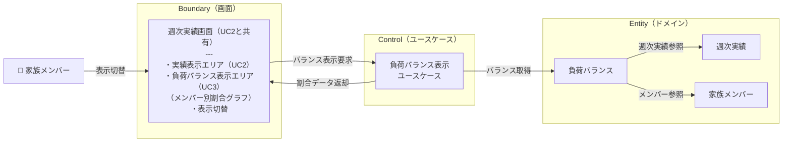

# ロバストネス図 - UC3: 負荷バランスを確認する

## 前提
- UC2（週次実績）と同一画面内で表示を切り替える
- 負荷バランスは家族メンバーごとの担当割合（%）で表現

```mermaid
flowchart LR
    actor["👤 家族メンバー"]

    subgraph Boundary["Boundary（画面）"]
        screen["週次実績画面（UC2と共有）\n---\n・実績表示エリア（UC2）\n・負荷バランス表示エリア（UC3）\n　（メンバー別割合グラフ）\n・表示切替"]
    end

    subgraph Control["Control（ユースケース）"]
        uc["負荷バランス表示\nユースケース"]
    end

    subgraph Entity["Entity（ドメイン）"]
        balance["負荷バランス"]
        summary["週次実績"]
        member["家族メンバー"]
    end

    actor -->|表示切替| screen
    screen -->|バランス表示要求| uc
    uc -->|バランス取得| balance
    balance -->|週次実績参照| summary
    balance -->|メンバー参照| member
    uc -->|割合データ返却| screen
```
