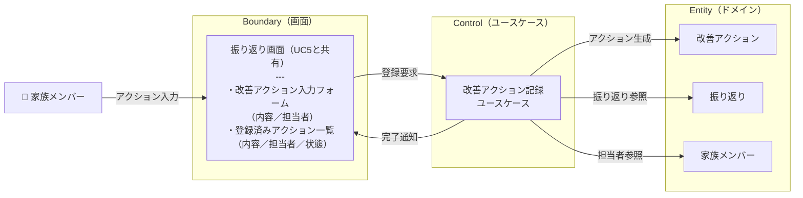

# ロバストネス図 - UC4: 改善アクションを記録する

## 前提
- 振り返り画面内で改善アクションを入力する（UC5と画面共有）
- 入力項目：アクション内容・担当者
- 初期ステータスは「未着手」で自動設定

```mermaid
flowchart LR
    actor["👤 家族メンバー"]

    subgraph Boundary["Boundary（画面）"]
        screen["振り返り画面（UC5と共有）\n---\n・改善アクション入力フォーム\n　（内容／担当者）\n・登録済みアクション一覧\n　（内容／担当者／状態）"]
    end

    subgraph Control["Control（ユースケース）"]
        uc["改善アクション記録\nユースケース"]
    end

    subgraph Entity["Entity（ドメイン）"]
        action["改善アクション"]
        retro["振り返り"]
        member["家族メンバー"]
    end

    actor -->|アクション入力| screen
    screen -->|登録要求| uc
    uc -->|振り返り参照| retro
    uc -->|担当者参照| member
    uc -->|アクション生成| action
    uc -->|完了通知| screen
```
