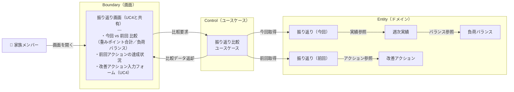

# ロバストネス図 - UC5: 振り返りを比較する

## 前提
- 振り返り画面内でUC4（改善アクション記録）と画面共有
- 今回と前回の重みポイント合計・負荷バランスを並べて比較する
- 前回のアクションの達成状況も確認できる

```mermaid
flowchart LR
    actor["👤 家族メンバー"]

    subgraph Boundary["Boundary（画面）"]
        screen["振り返り画面（UC4と共有）\n---\n・今回 vs 前回 比較\n　（重みポイント合計／負荷バランス）\n・前回アクションの達成状況\n・改善アクション入力フォーム（UC4）"]
    end

    subgraph Control["Control（ユースケース）"]
        uc["振り返り比較\nユースケース"]
    end

    subgraph Entity["Entity（ドメイン）"]
        retro["振り返り（今回）"]
        prevRetro["振り返り（前回）"]
        summary["週次実績"]
        balance["負荷バランス"]
        action["改善アクション"]
    end

    actor -->|画面を開く| screen
    screen -->|比較要求| uc
    uc -->|今回取得| retro
    uc -->|前回取得| prevRetro
    retro -->|実績参照| summary
    summary -->|バランス参照| balance
    prevRetro -->|アクション参照| action
    uc -->|比較データ返却| screen
```
