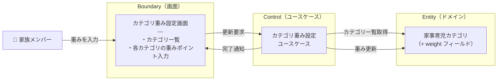

# ロバストネス図 - UC6: カテゴリの重みを設定する

## 前提
- 家族で話し合って決めた重みをアプリに登録する
- カテゴリごとに重み（ポイント）を設定できる
- 重みはload_balanceの計算に使用される

```mermaid
flowchart LR
    actor["👤 家族メンバー"]

    subgraph Boundary["Boundary（画面）"]
        screen["カテゴリ重み設定画面\n---\n・カテゴリ一覧\n・各カテゴリの重みポイント入力"]
    end

    subgraph Control["Control（ユースケース）"]
        uc["カテゴリ重み設定\nユースケース"]
    end

    subgraph Entity["Entity（ドメイン）"]
        category["家事育児カテゴリ\n（+ weight フィールド）"]
    end

    actor -->|重みを入力| screen
    screen -->|更新要求| uc
    uc -->|カテゴリ一覧取得| category
    uc -->|重み更新| category
    uc -->|完了通知| screen
```
