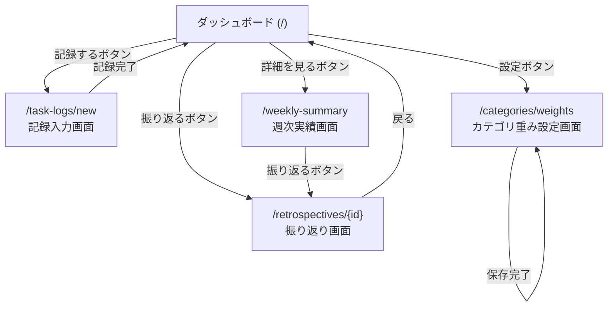

# 画面設計書

> フェーズ1（Thymeleaf + Spring MVC）の設計。フェーズ2移行時はAPI設計書に置き換わる。

---

## 画面一覧

| 画面名 | URL | 対応UC |
|--------|-----|--------|
| ダッシュボード | `/` | UC2, UC3 |
| 記録入力画面 | `/task-logs/new` | UC1 |
| 週次実績画面 | `/weekly-summary` | UC2, UC3 |
| 振り返り画面 | `/retrospectives/{id}` | UC4, UC5 |
| カテゴリ重み設定画面 | `/categories/weights` | UC6 |

---

## 画面遷移図

---

## 各画面の詳細

### 1. ダッシュボード (`/`)

**目的：** アプリを開いた瞬間に今週の状況を把握できる

| 要素 | 内容 |
|------|------|
| 今週の負荷バランス | 家族メンバー別の重みポイント割合（円グラフ） |
| 今週のサマリー | 誰が合計何ポイント分担当したか |
| 記録するボタン | 記録入力画面へ遷移 |
| 詳細を見るボタン | 週次実績画面へ遷移 |
| 振り返るボタン | 最新の振り返り画面へ遷移 |
| 設定ボタン | カテゴリ重み設定画面へ遷移 |

---

### 2. 記録入力画面 (`/task-logs/new`)

**目的：** 家事・育児の実施を記録する（UC1）

| 要素 | 内容 |
|------|------|
| カテゴリ選択 | ドロップダウン（マスタから取得） |
| 担当者選択 | ラジオボタン or ボタン選択（固定メンバー） |
| 所要時間入力 | 数値入力（分） |
| 記録するボタン | POST /task-logs → ダッシュボードへリダイレクト |

---

### 3. 週次実績画面 (`/weekly-summary`)

**目的：** 週ごとの家事・育児実績と負荷バランスを確認する（UC2, UC3）

| 要素 | 内容 |
|------|------|
| 週選択 | 前週・翌週の矢印ナビゲーション |
| 表示切替タブ | 「実績」（UC2） / 「負荷バランス」（UC3） |
| グラフエリア | 円グラフ（デフォルト）+ グラフ種別切替 |
| 実績一覧 | 担当者・カテゴリ・所要時間の一覧（UC2タブ） |
| 負荷バランス表示 | メンバー別重みポイント合計と割合（UC3タブ） |
| 振り返るボタン | 対象週の振り返り画面へ遷移 |

---

### 4. 振り返り画面 (`/retrospectives/{id}`)

**目的：** 今回と前回の振り返りを比較し、改善アクションを記録する（UC4, UC5）

| 要素 | 内容 |
|------|------|
| 比較セクション | 今回 vs 前回の重みポイント合計・負荷バランスを横並び表示 |
| 前回アクション一覧 | 前回決定したアクションと実践状況（UC5） |
| 実践状況更新 | 「未着手」「実践中」「完了」のステータス切替 |
| 新規アクション入力 | 内容・担当者を入力して登録（UC4） |
| アクション一覧 | 今回登録済みアクションの一覧 |

---

### 5. カテゴリ重み設定画面 (`/categories/weights`)

**目的：** 家族で決めた重みポイントをカテゴリごとに設定する（UC6）

| 要素 | 内容 |
|------|------|
| カテゴリ一覧 | カテゴリ名・種別・現在の重みポイントを一覧表示 |
| 重み入力 | 各カテゴリの重みポイントを数値入力（1以上の整数） |
| 保存ボタン | POST /categories/weights → 同画面にリダイレクト（完了メッセージ表示） |
