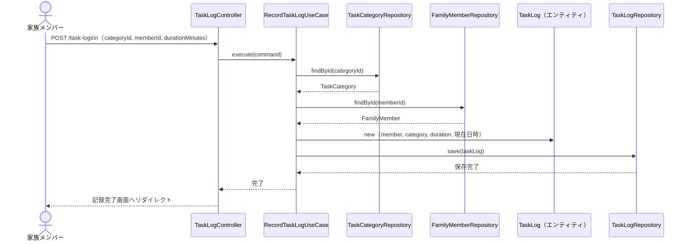

# シーケンス図 - UC1: 家事・育児を記録する

```mermaid
sequenceDiagram
    actor 家族メンバー
    participant Controller as TaskLogController
    participant UseCase as RecordTaskLogUseCase
    participant CategoryRepo as TaskCategoryRepository
    participant MemberRepo as FamilyMemberRepository
    participant TaskLog as TaskLog（エンティティ）
    participant TaskLogRepo as TaskLogRepository

    家族メンバー ->> Controller: POST /task-logs\n（categoryId, memberId, durationMinutes）
    Controller ->> UseCase: execute(command)
    UseCase ->> CategoryRepo: findById(categoryId)
    CategoryRepo -->> UseCase: TaskCategory
    UseCase ->> MemberRepo: findById(memberId)
    MemberRepo -->> UseCase: FamilyMember
    UseCase ->> TaskLog: new（member, category, duration, 現在日時）
    UseCase ->> TaskLogRepo: save(taskLog)
    TaskLogRepo -->> UseCase: 保存完了
    UseCase -->> Controller: 完了
    Controller -->> 家族メンバー: 記録完了画面へリダイレクト
```
