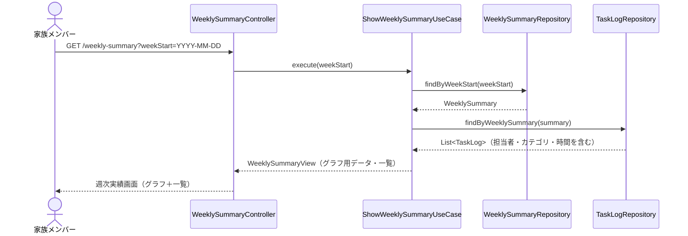

# シーケンス図 - UC2: 週次実績を確認する

```mermaid
sequenceDiagram
    actor 家族メンバー
    participant Controller as WeeklySummaryController
    participant UseCase as ShowWeeklySummaryUseCase
    participant SummaryRepo as WeeklySummaryRepository
    participant TaskLogRepo as TaskLogRepository

    家族メンバー ->> Controller: GET /weekly-summary?weekStart=YYYY-MM-DD
    Controller ->> UseCase: execute(weekStart)
    UseCase ->> SummaryRepo: findByWeekStart(weekStart)
    SummaryRepo -->> UseCase: WeeklySummary
    UseCase ->> TaskLogRepo: findByWeeklySummary(summary)
    TaskLogRepo -->> UseCase: List<TaskLog>（担当者・カテゴリ・時間を含む）
    UseCase -->> Controller: WeeklySummaryView（グラフ用データ・一覧）
    Controller -->> 家族メンバー: 週次実績画面（グラフ＋一覧）
```
