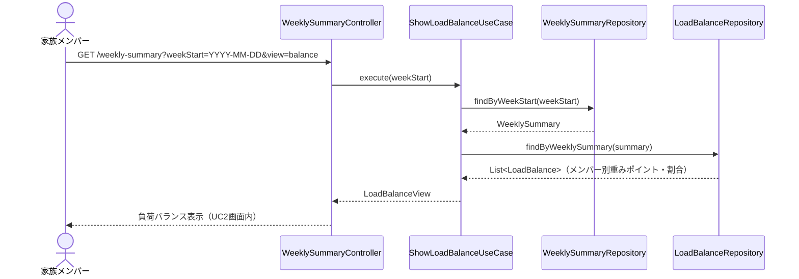

# シーケンス図 - UC3: 負荷バランスを確認する

```mermaid
sequenceDiagram
    actor 家族メンバー
    participant Controller as WeeklySummaryController
    participant UseCase as ShowLoadBalanceUseCase
    participant SummaryRepo as WeeklySummaryRepository
    participant BalanceRepo as LoadBalanceRepository

    家族メンバー ->> Controller: GET /weekly-summary?weekStart=YYYY-MM-DD&view=balance
    Controller ->> UseCase: execute(weekStart)
    UseCase ->> SummaryRepo: findByWeekStart(weekStart)
    SummaryRepo -->> UseCase: WeeklySummary
    UseCase ->> BalanceRepo: findByWeeklySummary(summary)
    BalanceRepo -->> UseCase: List<LoadBalance>（メンバー別重みポイント・割合）
    UseCase -->> Controller: LoadBalanceView
    Controller -->> 家族メンバー: 負荷バランス表示（UC2画面内）
```
