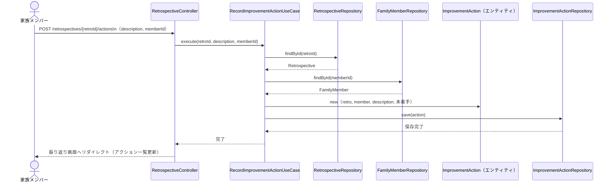

# シーケンス図 - UC4: 改善アクションを記録する

```mermaid
sequenceDiagram
    actor 家族メンバー
    participant Controller as RetrospectiveController
    participant UseCase as RecordImprovementActionUseCase
    participant RetroRepo as RetrospectiveRepository
    participant MemberRepo as FamilyMemberRepository
    participant Action as ImprovementAction（エンティティ）
    participant ActionRepo as ImprovementActionRepository

    家族メンバー ->> Controller: POST /retrospectives/{retroId}/actions\n（description, memberId）
    Controller ->> UseCase: execute(retroId, description, memberId)
    UseCase ->> RetroRepo: findById(retroId)
    RetroRepo -->> UseCase: Retrospective
    UseCase ->> MemberRepo: findById(memberId)
    MemberRepo -->> UseCase: FamilyMember
    UseCase ->> Action: new（retro, member, description, 未着手）
    UseCase ->> ActionRepo: save(action)
    ActionRepo -->> UseCase: 保存完了
    UseCase -->> Controller: 完了
    Controller -->> 家族メンバー: 振り返り画面へリダイレクト（アクション一覧更新）
```
