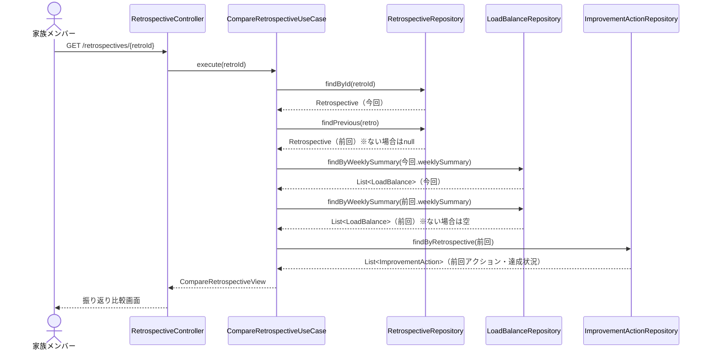

# シーケンス図 - UC5: 振り返りを比較する

```mermaid
sequenceDiagram
    actor 家族メンバー
    participant Controller as RetrospectiveController
    participant UseCase as CompareRetrospectiveUseCase
    participant RetroRepo as RetrospectiveRepository
    participant BalanceRepo as LoadBalanceRepository
    participant ActionRepo as ImprovementActionRepository

    家族メンバー ->> Controller: GET /retrospectives/{retroId}
    Controller ->> UseCase: execute(retroId)
    UseCase ->> RetroRepo: findById(retroId)
    RetroRepo -->> UseCase: Retrospective（今回）
    UseCase ->> RetroRepo: findPrevious(retro)
    RetroRepo -->> UseCase: Retrospective（前回）※ない場合はnull

    UseCase ->> BalanceRepo: findByWeeklySummary(今回.weeklySummary)
    BalanceRepo -->> UseCase: List<LoadBalance>（今回）
    UseCase ->> BalanceRepo: findByWeeklySummary(前回.weeklySummary)
    BalanceRepo -->> UseCase: List<LoadBalance>（前回）※ない場合は空

    UseCase ->> ActionRepo: findByRetrospective(前回)
    ActionRepo -->> UseCase: List<ImprovementAction>（前回アクション・達成状況）

    UseCase -->> Controller: CompareRetrospectiveView
    Controller -->> 家族メンバー: 振り返り比較画面
```
