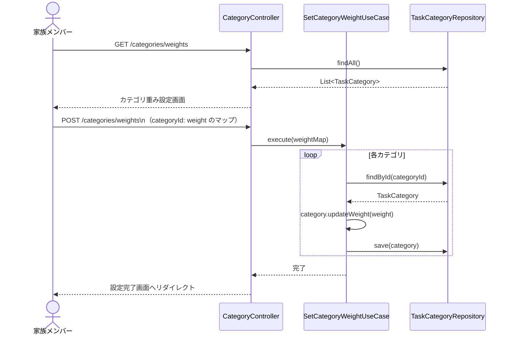

# シーケンス図 - UC6: カテゴリの重みを設定する

```mermaid
sequenceDiagram
    actor 家族メンバー
    participant Controller as CategoryController
    participant UseCase as SetCategoryWeightUseCase
    participant CategoryRepo as TaskCategoryRepository

    家族メンバー ->> Controller: GET /categories/weights
    Controller ->> CategoryRepo: findAll()
    CategoryRepo -->> Controller: List<TaskCategory>
    Controller -->> 家族メンバー: カテゴリ重み設定画面

    家族メンバー ->> Controller: POST /categories/weights\n（categoryId: weight のマップ）
    Controller ->> UseCase: execute(weightMap)
    loop 各カテゴリ
        UseCase ->> CategoryRepo: findById(categoryId)
        CategoryRepo -->> UseCase: TaskCategory
        UseCase ->> UseCase: category.updateWeight(weight)
        UseCase ->> CategoryRepo: save(category)
    end
    UseCase -->> Controller: 完了
    Controller -->> 家族メンバー: 設定完了画面へリダイレクト
```
