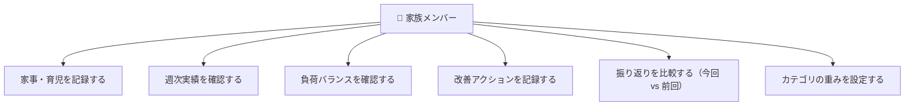

# ユースケース図

```mermaid
graph TD
    actor["👤 家族メンバー"]

    actor --> UC1["家事・育児を記録する"]
    actor --> UC2["週次実績を確認する"]
    actor --> UC3["負荷バランスを確認する"]
    actor --> UC4["改善アクションを記録する"]
    actor --> UC5["振り返りを比較する（今回 vs 前回）"]
    actor --> UC6["カテゴリの重みを設定する"]
```
