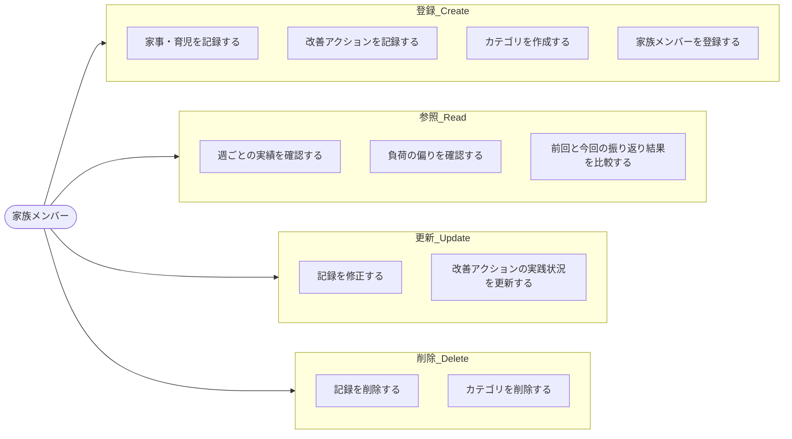

```mermaid
flowchart LR
    家族メンバー([家族メンバー])

    subgraph 登録_Create
        UC1[家事・育児を記録する]
        UC4[改善アクションを記録する]
        UC_CAT_C[カテゴリを作成する]
        UC_MEMBER[家族メンバーを登録する]
    end

    subgraph 参照_Read
        UC2[週ごとの実績を確認する]
        UC3[負荷の偏りを確認する]
        UC5[前回と今回の振り返り結果を比較する]
    end

    subgraph 更新_Update
        UC1b_U[記録を修正する]
        UC4b[改善アクションの実践状況を更新する]
    end

    subgraph 削除_Delete
        UC1b_D[記録を削除する]
        UC_CAT_D[カテゴリを削除する]
    end

    家族メンバー --> 登録_Create
    家族メンバー --> 参照_Read
    家族メンバー --> 更新_Update
    家族メンバー --> 削除_Delete
```
