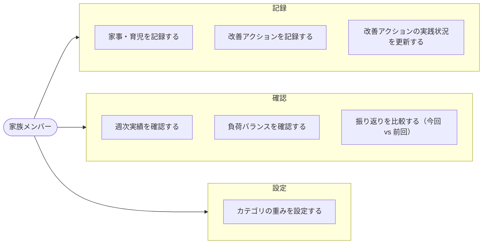

```mermaid
flowchart LR
    家族メンバー([家族メンバー])

    subgraph 記録
        UC1[家事・育児を記録する]
        UC4[改善アクションを記録する]
        UC4b[改善アクションの実践状況を更新する]
    end

    subgraph 確認
        UC2[週次実績を確認する]
        UC3[負荷バランスを確認する]
        UC5[振り返りを比較する（今回 vs 前回）]
    end

    subgraph 設定
        UC6[カテゴリの重みを設定する]
    end

    家族メンバー --> 記録
    家族メンバー --> 確認
    家族メンバー --> 設定
```
